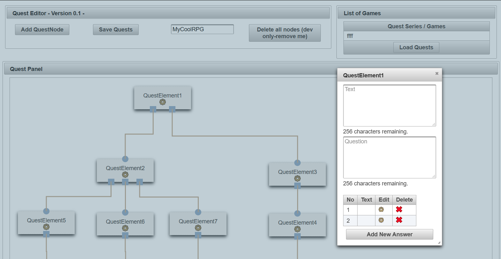

# text-adventure : A Spring Boot based Text Adventure Toolkit #

__Welcome!__
 
This is a public repository for a Spring Boot based Text Adventure Toolkit (Player, Editor)

Everyone who is interested in creating text-adventure should have the possibility to do so as easy as possible.
Further this toolkit should allow quest-designer to design or prototype a quest-line.
 
The current state is: __in development__.

The intensions behind the toolkit are:
* easy to use text-adventure editor and player (commandline and browser)
* easy to use quest-line designer for game-developers (for exporting in a RPG game....)
* ready-to-deliver text adventures
* ready-to-integrate quest/story lines 

## Current State : "in development" ##
The State 'in development' simply says, that this software is currently not intended as finished or ready to use productively.
data structures are may subject to be changed.

Further, the use of this software is currently for curious developers or technical users who want to quick-start into making
a text-adventure.
    
## Todo-List ##
This Todo-List should give you an overview of the next planned steps.
The order of those points is meant as a loose priority list.  
This is a living list. Points may be added and priorities maybe shifted.

* Development:
    - ##### planned for first build SNAPSHOT Version 1.0.0 #####
    ~~- [ ] provide pre-compiled jar files here in git~~
    - [x] provide precompiled jar (no time for messing with those github stuff)
    - [x] fixing class-1 bugs
    - ##### planned for RELEASE Version 1.0.0 #####    
    - [ ] re-implement a working quest-player
        - [ ] command Line version -> github issue #3
        - [ ] browser embedded version -> github issue #4
    - [ ] colors for html and command line player -> github issue #5       
    - [ ] initializing the application (first run)
    - [ ] embedded database  
    - [ ] fixing class-2 bugs -> github issue #1   
    - ##### planned for RELEASE Version 1.1.0 #####    
    - [ ] design the ui for more simple usage
    - [ ] export-interface for quest-line
    - [ ] extend the Quest-Datastructure for assigning NPCs
    - [ ] export as runnable file (exe/linux executable rather than a jar)    
    - [ ] simple savestates for quest-interpreters / "players"
    - [ ] unit tests
    - ##### general tasks without version-bounds: #####
    - [ ] use github bug-tracking / task-system
    - [ ] architecture overview / source documentation
* Non-Development:
    - [ ]  Documentation
    
## Known Bugs / Issues ##
~~- class-1 bugs:
    - saving sometimes does not work~~
- class 2 bugs:
- Interface: after adding a quest-box the editing of these dont work.
    - current workaround: simply refresh / reload the  browser-window twice
      
## Roadmap
tbd.
      
## Background Story ##

Back in 2015 i've started to develop a 2d RPG Game in Unity. Whilist game-play implementations are done by approx. 70% i've noticed
that i can't progress in creating the story line for the game. Using solely unity for integrating the story into the game is not
efficent, as it requires to maintain all the npcs and objects involved in a specific quest by hand. this is a lot of work, there's no
good overview and it can be confusing. A toolkit, which is easy to use and has even a preview function and an exporter in a 
custom defined format is the answer for resolving this task. Using existing tools was an option, but there were either to expensive,
to complex or even incomplete. The idea of an own toolkit was born.

The first idea was a quest-creating toolkit but this idea has been extended to a hybrid toolkit: you can design now a text-adventure only,
or if required to export the questline into a desired format.
Simple said: The goal is now to create a simple to use, but yet powerful text-adventure toolkit for the masses :)
    
## How to run - Instructions ##
This instruction is intended to give you a simple set of instruction to execute on your local computer. 
For advanced users - feel free to try it out and give feedback - but please Please take notes of the Know Bugs / Issues.

Requirmentes:
1) java jdk > 11.03  (never tested jre...) https://www.oracle.com/java/technologies/javase-jdk11-downloads.html
1) maria db 10.4 https://downloads.mariadb.org/mariadb/10.4.12/
1) maven > 3.3 https://maven.apache.org/download.cgi

The current Version is source code only. In order to test this tool or make this run, follow these instructions.

1) Download mariadb 10.4 stable at: https://downloads.mariadb.org/mariadb/10.4.12/
1) Install mariadb with heidi-sql
1) Get maven > 3.3+ https://maven.apache.org/download.cgi (maven bin)
    1) it is may required to add maven to PATH-variable of your system
1) Execute following SQL Script : [Script below](#sql-script "goto sql script")
1) now you have the options:
    1) build yourself  
    1) or download at my project-homepage: https://gamesground.net/text-adventure-project/ 
    Skip the next step (clone the repository) if you download the snapshot on my homepage    
1) clone the repository then build with maven:
    1) mvn clean install on quest-core
    1) mvn clean compile package on quest-designer
1) after build or download run the jar-file 'quest-designer-1.0.0-SNAPSHOT.jar' with java -jar
1) or use your prefered IDE to build all of them
1) hibernate will create the required database tables
1) editor will be located at: http://localhost:8080/index.xhtml (unless you change the port in application.properties)

##### SQL SCRIPT #####
    -- create database
    CREATE DATABASE quest_data
        CHARACTER SET = 'utf8'
        COLLATE = 'utf8_general_ci';

    -- create user
    CREATE USER 'questuser'@'localhost';

    -- grant privileges to user
    GRANT ALL PRIVILEGES ON quest_data.* To 'questuser'@'localhost' IDENTIFIED BY 'password';
    GRANT ALL ON quest_data.* TO 'questuser'@'localhost';
    FLUSH PRIVILEGES;

# End Infos #

Editor will be available at:
http://localhost:8080/index.xhtml

Player currently not tested / updated!

Good luck - official and new content will be added.

feel free to visit: https://www.gamesground.net
